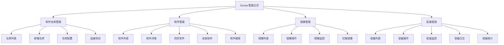

# Vue Support Monitor Starter - 前端Docker管理重构方案

## 📋 项目概述

本文档为vue-support-monitor-starter前端项目的Docker管理功能重构提供详细的架构设计、页面设计和开发指南。

## 🎯 核心目标

1. **重新设计Docker管理界面**：提供现代化、直观的用户体验
2. **完整功能覆盖**：支持软件仓库管理、软件管理、镜像管理、容器管理四大核心模块
3. **实时状态监控**：集成WebSocket/SocketIO实现实时进度推送和状态更新
4. **响应式设计**：适配不同设备和屏幕尺寸
5. **遵循项目规范**：严格按照项目开发规范进行实现

## 🏗️ 架构设计

### 页面架构图


### 技术栈要求
- **Vue 3** + Composition API
- **TypeScript** 类型安全
- **Pinia** 状态管理
- **Vue Router 4** 路由管理
- **Element Plus** / **Ant Design Vue** UI组件库
- **IconifyIconOnline** 图标组件（项目规范要求）
- **ScTable** 表格组件（项目规范要求）
- **Socket.IO Client** 实时通信
- **Axios** HTTP请求

## 🎨 页面设计

### 1. Docker管理主页 (`/docker-management`)
**布局**：Dashboard风格的概览页面
- **顶部统计卡片**：仓库数量、软件数量、镜像数量、容器数量
- **快捷操作区**：同步软件、拉取镜像、启动容器等
- **状态监控面板**：实时显示系统状态和运行情况
- **最近操作日志**：显示最近的Docker操作记录

**组件结构**：
```vue
<template>
  <div class="docker-dashboard">
    <!-- 统计卡片区域 -->
    <StatisticsCards />
    
    <!-- 快捷操作区域 -->
    <QuickActions />
    
    <!-- 状态监控区域 -->
    <StatusMonitor />
    
    <!-- 操作日志区域 -->
    <OperationLogs />
  </div>
</template>
```

### 2. 软件仓库管理 (`/docker-management/registry`)
**功能模块**：
- **仓库列表**：ScTable展示仓库信息，支持分页、搜索、筛选
- **仓库操作**：新增、编辑、删除、测试连接、设置默认
- **批量操作**：批量启用/禁用仓库

**表格列设计**：
| 列名 | 字段 | 操作 |
|-----|-----|-----|
| 仓库名称 | registryName | 链接到详情 |
| 仓库类型 | registryType | 标签显示 |
| 仓库地址 | registryUrl | 可复制 |
| 连接状态 | connectStatus | 状态指示器 |
| 是否默认 | isDefault | 切换开关 |
| 创建时间 | createTime | 格式化显示 |
| 操作 | - | 编辑/删除/测试连接 |

### 3. 软件管理 (`/docker-management/software`)
**功能模块**：
- **软件列表**：支持按分类、状态筛选
- **软件搜索**：关键字搜索和高级筛选
- **同步功能**：从仓库同步软件信息，带进度条
- **安装功能**：选择服务器安装软件

**关键交互**：
- **同步按钮**：点击后显示同步进度对话框，实时显示同步状态
- **安装按钮**：弹出服务器选择对话框，支持多选
- **标签筛选**：快速筛选热门、最新、官方软件

### 4. 镜像管理 (`/docker-management/image`)
**功能模块**：
- **镜像列表**：按服务器分组显示
- **镜像操作**：拉取、启动、停止、删除
- **状态监控**：实时显示镜像状态
- **日志查看**：镜像操作日志

**特殊功能**：
- **启动参数配置**：弹出表单配置端口映射、环境变量、数据卷
- **实时日志**：WebSocket连接显示实时操作日志

### 5. 容器管理 (`/docker-management/container`)
**功能模块**：
- **容器列表**：实时状态显示
- **容器操作**：启动、停止、重启、删除
- **容器监控**：CPU、内存、网络使用情况
- **日志查看**：实时日志流

**监控面板**：
- **资源使用图表**：实时CPU和内存使用率
- **网络流量图**：实时网络IO统计
- **存储使用情况**：磁盘使用统计

## 🔧 组件设计

### 公共组件

#### 1. StatusIndicator 状态指示器
```vue
<template>
  <div class="status-indicator" :class="statusClass">
    <iconify-icon-online :icon="statusIcon" />
    <span>{{ statusText }}</span>
  </div>
</template>
```

#### 2. OperationButton 操作按钮
```vue
<template>
  <el-button
    :type="buttonType"
    :loading="loading"
    @click="handleClick"
  >
    <iconify-icon-online :icon="icon" />
    {{ text }}
  </el-button>
</template>
```

#### 3. RealTimeLog 实时日志组件
```vue
<template>
  <div class="realtime-log">
    <div class="log-header">
      <span>实时日志</span>
      <el-button @click="clearLogs">清空</el-button>
    </div>
    <div class="log-content" ref="logContainer">
      <div v-for="log in logs" :key="log.id" class="log-item">
        {{ log.timestamp }} - {{ log.message }}
      </div>
    </div>
  </div>
</template>
```

### 业务组件

#### 1. SoftwareSyncDialog 软件同步对话框
```vue
<template>
  <el-dialog v-model="visible" title="同步软件信息">
    <div class="sync-progress">
      <el-progress :percentage="progress" :status="status" />
      <div class="sync-logs">
        <div v-for="log in syncLogs" :key="log.id">
          {{ log.message }}
        </div>
      </div>
    </div>
  </el-dialog>
</template>
```

#### 2. ContainerMonitor 容器监控组件
```vue
<template>
  <div class="container-monitor">
    <div class="monitor-charts">
      <div class="cpu-chart">
        <h4>CPU使用率</h4>
        <line-chart :data="cpuData" />
      </div>
      <div class="memory-chart">
        <h4>内存使用</h4>
        <line-chart :data="memoryData" />
      </div>
    </div>
  </div>
</template>
```

## 📡 API集成

### API Service封装
```typescript
// api/docker-registry.ts
export const dockerRegistryApi = {
  // 获取仓库列表
  getList: (params: RegistryQueryParams) => 
    request.get('/api/monitor/system-soft-registry/list', { params }),
  
  // 新增仓库
  create: (data: SystemSoftRegistry) => 
    request.post('/api/monitor/system-soft-registry', data),
  
  // 测试连接
  testConnection: (id: number) => 
    request.post(`/api/monitor/system-soft-registry/${id}/test-connection`),
  
  // 设置默认
  setDefault: (id: number) => 
    request.post(`/api/monitor/system-soft-registry/${id}/set-default`)
}

// api/docker-software.ts
export const dockerSoftwareApi = {
  // 获取软件列表
  getList: (params: SoftwareQueryParams) => 
    request.get('/api/monitor/system-soft/list', { params }),
  
  // 同步软件
  sync: (registryId?: number) => 
    request.post('/api/monitor/system-soft/sync', { registryId }),
  
  // 安装软件
  install: (data: InstallSoftwareRequest) => 
    request.post('/api/monitor/system-soft/install', data)
}
```

### 响应数据处理
```typescript
// 统一响应处理
interface ApiResponse<T> {
  code: number
  data: T
  msg: string
  ok: boolean
}

// 错误处理
const handleApiError = (error: any) => {
  if (error.response?.data?.msg) {
    ElMessage.error(error.response.data.msg)
  } else {
    ElMessage.error('操作失败，请稍后重试')
  }
}
```

## 🔄 状态管理

### Pinia Store设计
```typescript
// stores/docker.ts
export const useDockerStore = defineStore('docker', {
  state: () => ({
    // 仓库管理
    registries: [] as SystemSoftRegistry[],
    
    // 软件管理
    softwares: [] as SystemSoft[],
    
    // 镜像管理
    images: [] as SystemSoftImage[],
    
    // 容器管理
    containers: [] as SystemSoftContainer[],
    
    // 实时状态
    realtimeStatus: {
      syncing: false,
      syncProgress: 0,
      operationLogs: [] as OperationLog[]
    }
  }),
  
  actions: {
    // 仓库操作
    async loadRegistries() {
      const response = await dockerRegistryApi.getList({})
      this.registries = response.data
    },
    
    // 软件同步
    async syncSoftware(registryId?: number) {
      this.realtimeStatus.syncing = true
      try {
        const response = await dockerSoftwareApi.sync(registryId)
        ElMessage.success(`同步成功，共同步${response.data}个软件`)
      } finally {
        this.realtimeStatus.syncing = false
      }
    }
  }
})
```

## 🌐 实时功能集成

### Socket.IO配置
```typescript
// plugins/socket.ts
import { io, Socket } from 'socket.io-client'

class SocketService {
  private socket: Socket | null = null
  
  connect() {
    this.socket = io(import.meta.env.VITE_SOCKET_URL, {
      transports: ['websocket']
    })
    
    this.socket.on('connect', () => {
      console.log('Socket连接成功')
    })
    
    // 监听容器状态变化
    this.socket.on('container-status', (data) => {
      const dockerStore = useDockerStore()
      dockerStore.updateContainerStatus(data)
    })
    
    // 监听同步进度
    this.socket.on('sync-progress', (data) => {
      const dockerStore = useDockerStore()
      dockerStore.updateSyncProgress(data)
    })
  }
  
  disconnect() {
    if (this.socket) {
      this.socket.disconnect()
      this.socket = null
    }
  }
}

export const socketService = new SocketService()
```

## 🎨 样式设计

### 主题色彩
```scss
// styles/variables.scss
$primary-color: #409EFF;
$success-color: #67C23A;
$warning-color: #E6A23C;
$danger-color: #F56C6C;
$info-color: #909399;

// Docker状态色彩
$docker-running: #67C23A;
$docker-stopped: #909399;
$docker-error: #F56C6C;
$docker-pending: #E6A23C;
```

### 响应式设计
```scss
// 移动端适配
@media (max-width: 768px) {
  .docker-dashboard {
    .statistics-cards {
      grid-template-columns: repeat(2, 1fr);
    }
    
    .operation-buttons {
      flex-direction: column;
      gap: 8px;
    }
  }
}
```

## 🔀 路由设计

```typescript
// router/docker.ts
export const dockerRoutes = [
  {
    path: '/docker-management',
    name: 'DockerManagement',
    component: () => import('@/views/docker/index.vue'),
    meta: { title: 'Docker管理' },
    children: [
      {
        path: '',
        name: 'DockerDashboard',
        component: () => import('@/views/docker/dashboard.vue'),
        meta: { title: 'Docker概览' }
      },
      {
        path: 'registry',
        name: 'DockerRegistry',
        component: () => import('@/views/docker/registry/index.vue'),
        meta: { title: '软件仓库管理' }
      },
      {
        path: 'software',
        name: 'DockerSoftware', 
        component: () => import('@/views/docker/software/index.vue'),
        meta: { title: '软件管理' }
      },
      {
        path: 'image',
        name: 'DockerImage',
        component: () => import('@/views/docker/image/index.vue'),
        meta: { title: '镜像管理' }
      },
      {
        path: 'container',
        name: 'DockerContainer',
        component: () => import('@/views/docker/container/index.vue'),
        meta: { title: '容器管理' }
      }
    ]
  }
]
```

## 📱 用户体验设计

### 交互反馈
1. **操作确认**：危险操作（删除、停止）需要二次确认
2. **loading状态**：所有异步操作显示loading状态
3. **进度提示**：长时间操作显示进度条
4. **错误处理**：友好的错误提示和重试机制

### 数据刷新策略
1. **自动刷新**：列表数据定时自动刷新
2. **实时更新**：通过WebSocket推送实时状态变化
3. **手动刷新**：提供手动刷新按钮
4. **缓存策略**：合理使用缓存减少不必要的请求

## 🧪 开发规范

### 代码规范
1. **图标使用**：统一使用IconifyIconOnline组件
2. **表格组件**：使用ScTable代替普通表格
3. **API调用**：使用async/await + try/catch错误处理
4. **类型安全**：所有API接口定义TypeScript类型

### 性能优化
1. **组件懒加载**：路由级别组件使用懒加载
2. **表格虚拟滚动**：大数据量表格使用虚拟滚动
3. **防抖节流**：搜索和频繁操作使用防抖
4. **资源优化**：图片懒加载、代码分割

## 📋 开发任务清单

### Phase 1: 基础架构搭建
- [ ] 创建项目目录结构
- [ ] 配置路由和状态管理
- [ ] 搭建API服务层
- [ ] 配置Socket.IO客户端

### Phase 2: 核心页面开发
- [ ] Docker管理主页
- [ ] 软件仓库管理页面
- [ ] 软件管理页面
- [ ] 镜像管理页面
- [ ] 容器管理页面

### Phase 3: 实时功能集成
- [ ] WebSocket连接管理
- [ ] 实时状态推送
- [ ] 进度监控组件
- [ ] 日志流显示

### Phase 4: 测试和优化
- [ ] 单元测试
- [ ] 集成测试
- [ ] 性能优化
- [ ] 用户体验测试

## 🔗 后续扩展

### 未来功能规划
1. **多集群管理**：支持多个Docker集群管理
2. **监控告警**：容器异常状态告警
3. **自动化部署**：CI/CD集成
4. **资源管理**：Docker资源配额管理
5. **安全管理**：容器安全扫描和权限管理

---

## 💡 开发建议

1. **分阶段开发**：按照功能模块逐步开发，确保每个模块功能完整
2. **频繁测试**：开发过程中频繁与后端API对接测试
3. **用户反馈**：及时收集使用反馈，优化用户体验
4. **文档维护**：及时更新开发文档和用户手册
5. **代码审查**：严格执行代码审查，确保代码质量

这个重构方案提供了完整的前端开发指导，确保能够完美对接已经重构的后端Docker管理API，实现现代化的Docker管理界面。