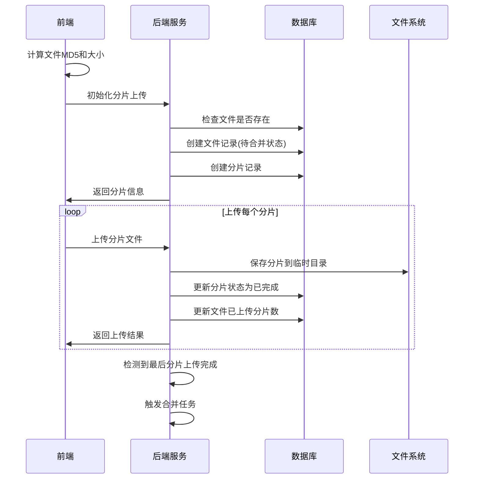
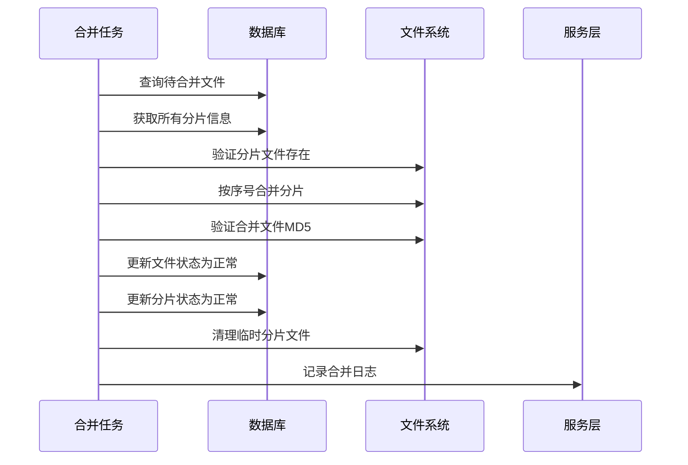
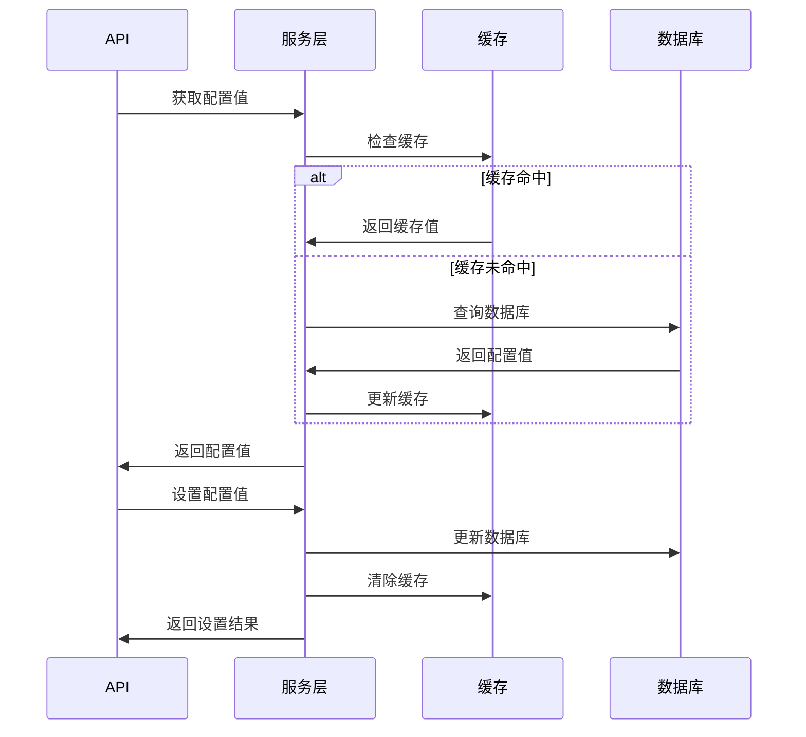

# 文件管理器(FileSystem)实现说明

## 功能概述

基于Spring Boot实现的完整文件管理器系统，支持分片上传、文件合并、下载管理等功能。所有相关组件均以`FileSystem`作为前缀。

## 核心功能

### 1. 文件查看和删除
- ✅ 分页查询文件列表
- ✅ 根据条件筛选文件
- ✅ 单个文件删除
- ✅ 批量文件删除
- ✅ 文件详情查看
- ✅ 文件统计信息

### 2. 分片上传功能
- ✅ 前端计算文件MD5和大小
- ✅ 后端返回分片数量和分片信息
- ✅ 分片记录管理(FileSystemPart)
- ✅ 文件状态管理(待合并状态)
- ✅ 上传进度跟踪
- ✅ 分片完整性验证

### 3. 文件合并任务
- ✅ 内部合并任务管理
- ✅ 任务状态检测
- ✅ 最后一个分片触发合并
- ✅ 合并成功后状态更新
- ✅ 失败重试机制
- ✅ 手动合并触发

### 4. 配置管理(FileSystemSetting)
- ✅ 缓存功能支持
- ✅ 合并任务数量配置(默认1)
- ✅ 手动合并开关(默认开启)
- ✅ 分片上传开关
- ✅ 文件类型白名单
- ✅ 文件下载开关(默认开启)
- ✅ HTTP访问开关

## 技术架构

### 数据库设计

#### 1. 主要实体表
```sql
-- 文件系统主表
monitor_sys_gen_file_system
- 文件基本信息(ID、名称、路径、大小、MD5等)
- 分片信息(是否分片、分片总数、已上传数)
- 状态管理(待合并、正常、失败、已删除)
- 下载统计(下载次数、最后下载时间)
- HTTP访问控制

-- 文件分片表  
monitor_sys_gen_file_system_part
- 分片详细信息(序号、大小、MD5、路径)
- 分片状态(待上传、处理中、已完成、失败)
- 重试机制(重试次数、错误信息)
- 时间跟踪(开始时间、完成时间)

-- 配置管理表
monitor_sys_gen_file_system_setting
- 配置项管理(键值对、类型、分组)
- 默认值和验证规则
- 启用状态和排序
```

#### 2. 索引优化
- 文件MD5唯一索引(防重复)
- 文件状态索引(快速筛选)
- 分片状态索引(合并任务查询)
- 用户索引(按用户查询)
- 时间索引(清理和统计)

### 服务层设计

#### 1. 核心服务接口
```java
// 文件系统主服务
MonitorSysGenFileSystemService
- 文件CRUD操作
- 分片上传初始化
- 文件下载管理
- 统计和清理功能

// 分片管理服务
MonitorSysGenFileSystemPartService  
- 分片记录管理
- 上传进度跟踪
- 完整性验证

// 配置管理服务
MonitorSysGenFileSystemSettingService
- 配置读写和缓存
- 类型转换和验证
- 批量操作

// 合并任务服务
MonitorSysGenFileSystemMergeTaskService
- 任务调度和执行
- 队列管理
- 状态监控
```

#### 2. 关键特性
- **缓存支持**: 配置项缓存，提升性能
- **事务管理**: 关键操作事务保护
- **异常处理**: 完善的错误处理和日志
- **并发控制**: 合并任务数量限制
- **重试机制**: 失败任务自动重试

### API接口设计

#### 1. 文件管理接口 (`/v1/filesystem`)
```http
GET    /page                    # 分页查询文件
POST   /chunk/init             # 初始化分片上传
POST   /chunk/upload           # 上传分片
GET    /chunk/status/{fileId}  # 检查上传状态
POST   /merge/{fileId}         # 手动触发合并
GET    /download/{fileId}      # 下载文件
DELETE /{fileId}               # 删除文件
DELETE /batch                  # 批量删除
GET    /statistics             # 统计信息
GET    /popular                # 热门文件
```

#### 2. 配置管理接口 (`/v1/filesystem/setting`)
```http
GET    /enabled                # 获取启用配置
GET    /value/{key}            # 获取配置值
PUT    /value/{key}            # 设置配置值
GET    /group/{group}          # 按分组查询
PUT    /batch                  # 批量设置
POST   /reset/{key}            # 重置默认值
POST   /refresh                # 刷新缓存
```

#### 3. 合并任务接口 (`/v1/filesystem/merge-task`)
```http
POST   /start                  # 启动合并任务
POST   /stop                   # 停止合并任务
GET    /status                 # 任务状态
POST   /trigger/{fileId}       # 手动触发
GET    /pending                # 待合并文件
POST   /process-queue          # 处理队列
POST   /retry-failed           # 重试失败任务
```

## 核心流程

### 1. 分片上传流程


### 2. 文件合并流程


### 3. 配置管理流程


## 默认配置项

### 合并任务配置
- `merge_task_count`: 1 (合并任务数量)
- `manual_merge_enabled`: true (手动合并开关)
- `merge_retry_count`: 3 (重试次数)
- `merge_timeout`: 300 (超时时间)

### 上传配置
- `chunk_upload_enabled`: true (分片上传开关)
- `chunk_size`: 5MB (分片大小)
- `max_file_size`: 1GB (最大文件大小)
- `upload_timeout`: 60 (上传超时)

### 安全配置
- `file_type_whitelist`: 常见文件类型 (白名单)
- `file_download_enabled`: true (下载开关)
- `http_access_enabled`: false (HTTP访问开关)
- `download_auth_required`: true (下载认证)

### 存储配置
- `storage_path`: /data/filesystem (存储路径)
- `temp_path`: /data/filesystem/temp (临时路径)
- `auto_clean_enabled`: true (自动清理)
- `clean_days`: 30 (保留天数)

## 部署说明

### 1. 数据库初始化
```bash
# 执行建表脚本
mysql -u root -p < docs/文件管理器数据库表结构.sql
```

### 2. 目录创建
```bash
# 创建存储目录
mkdir -p /data/filesystem
mkdir -p /data/filesystem/temp
chmod 755 /data/filesystem
```

### 3. 配置文件
```yaml
# application.yml
spring:
  servlet:
    multipart:
      max-file-size: 1GB
      max-request-size: 1GB
      
filesystem:
  storage-path: /data/filesystem
  temp-path: /data/filesystem/temp
  merge-task-count: 1
```

### 4. 启动服务
```bash
# 启动应用
java -jar monitor-starter.jar

# 初始化配置
curl -X POST http://localhost:8080/v1/filesystem/setting/init

# 启动合并任务
curl -X POST http://localhost:8080/v1/filesystem/merge-task/start
```

## 监控和维护

### 1. 关键指标监控
- 文件上传成功率
- 合并任务执行时间
- 存储空间使用率
- 分片失败重试次数

### 2. 定期维护任务
- 清理过期文件
- 清理孤立分片
- 重试失败任务
- 配置备份

### 3. 日志监控
- 上传下载日志
- 合并任务日志
- 错误异常日志
- 性能统计日志

这个文件管理器系统提供了完整的分片上传、文件管理和配置管理功能，具有良好的扩展性和可维护性。
